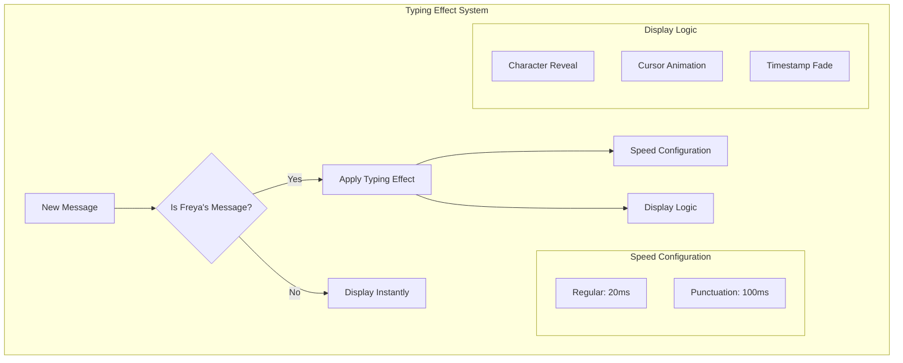
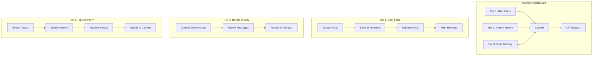
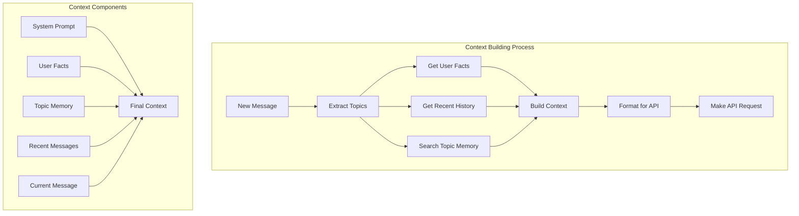
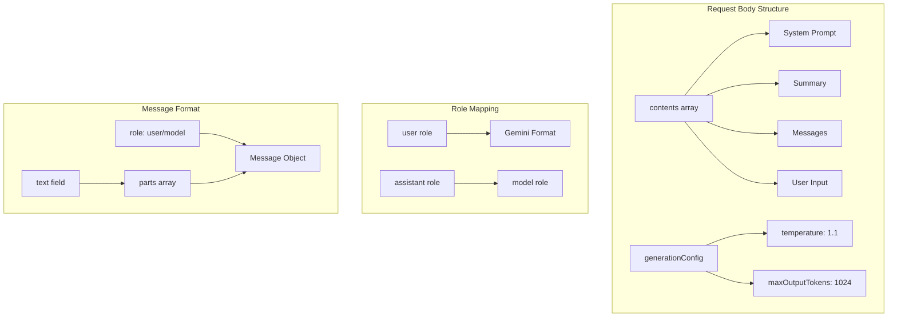

# Freya AI Chat - System Patterns

### UI Animation Patterns

The application implements carefully tuned animation patterns for optimal user experience:



Key characteristics:
- **Typing Effect**:
  - Applied only to new Freya messages
  - Regular character delay: 20ms
  - Punctuation pause: 100ms
  - Glowing cursor animation
  - Smooth timestamp fade-in
  
- **Performance Optimization**:
  - Historical messages load instantly
  - No typing effect for user messages
  - Efficient DOM updates
  - Smooth scrolling behavior

- **Animation Details**:
  - Character-by-character reveal
  - Teal glow effects matching theme
  - Cursor pulse animation
  - Timestamp opacity transition
  - Auto-scroll during typing

- **Implementation Features**:
  - Selective application logic
  - Configurable timing parameters
  - Clean animation cleanup
  - Memory-efficient approach

[Previous content up to API request patterns remains unchanged...]

### Memory System Pattern

The application uses a sophisticated 3-tier memory system for comprehensive context management:



Key characteristics:
- **Tier 1: User Facts Database**
  - Extracts facts about user (job, location, interests)
  - Stores in Firestore for persistence
  - Retrieves relevant facts based on context
  - Pattern-based fact extraction
  
- **Tier 2: Recent History**
  - Maintains current conversation flow
  - Includes recent messages for context
  - Proper role mapping for API
  - Chronological message ordering
  
- **Tier 3: Topic Memory**
  - Topic extraction from current message
  - Search across conversation history
  - Relevance scoring for matches
  - Selective inclusion in context

### Memory Context Building Pattern

The application uses a structured approach to building API context:



Key characteristics:
- **Structured Format**: Organized context building
  - System prompt (always included)
  - User facts (filtered by relevance)
  - Topic-based memory (if relevant)
  - Recent conversation history
  - Current user input
  
- **Efficiency Features**:
  - Topic-based retrieval
  - Relevance scoring
  - Selective memory inclusion
  - Role mapping optimization

- **Firebase Integration**:
  - User facts collection
  - Conversation history
  - Topic-based search
  - Memory retrieval

### API Request Structure Pattern

The application follows a consistent pattern for building API requests:



Implementation details:
```javascript
const requestBody = {
    contents: [
        // 1. System Prompt (new conversations only)
        isNewConversation && {
            role: "user",
            parts: [{ text: SYSTEM_PROMPT }]
        },
        
        // 2. Conversation Summary
        summary && {
            role: "user",
            parts: [{ text: `Summary of our past conversations:\n${summary}` }]
        },
        
        // 3. Recent Messages
        ...lastMessages.map(msg => ({
            role: msg.role === "assistant" ? "model" : "user",
            parts: [{ text: msg.content }]
        })),
        
        // 4. Current Input
        {
            role: "user",
            parts: [{ text: userInput }]
        }
    ].filter(Boolean),
    
    generationConfig: {
        temperature: 0.7,        // Reduced for better focus and coherence
        maxOutputTokens: 800     // Balanced length for meaningful responses
    }
};
```

Key features:
- **Structured Content**: Clear organization of request components
- **Role Mapping**: Proper transformation of roles for Gemini format
- **Conditional Inclusion**: System prompt and summary only when needed
- **Configuration**: 
  - Temperature: 0.7 for controlled, focused responses
  - Token limit: 800 for balanced message length
  - Consistent settings across all requests
- **Error Handling**: Proper validation and error management

[Rest of the file content remains unchanged...]
