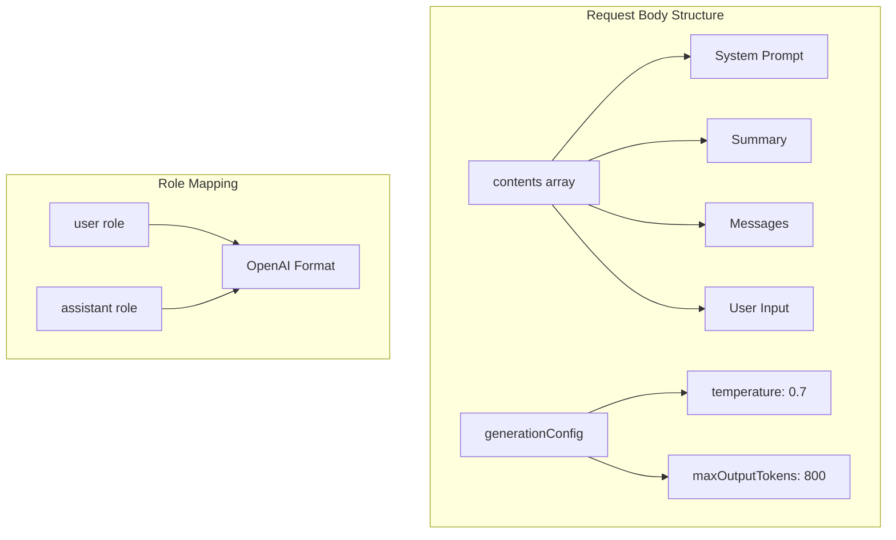

# Freya AI Chat - Technical Context

## Technology Stack Overview

Freya is built using a modern web technology stack with cloud-based services:

| Layer         | Technologies                                                                               |
|---------------|--------------------------------------------------------------------------------------------|
| **Frontend**  | HTML5, CSS3, JavaScript (ES6+)                                                              |
| **UI Design** | Custom CSS with CSS variables for theming                                                  |
| **AI Backend**| Fine-tuned OpenAI GPT‑4.1 Mini Model                                                         |
| **Database**  | Firebase Firestore                                                                         |
| **API Security** | Client-side localStorage for API key management                                         |
| **Deployment**| Local development (future: web hosting)                                                    |
| **Planned Integrations** | Model Context Protocol (MCP), NBA API                                             |

## Core Technologies

### Frontend Web Technologies

The application uses vanilla HTML, CSS, and JavaScript without a framework dependency. This approach was chosen to:
- Minimize dependencies and loading time
- Showcase fundamental web development skills
- Provide a lightweight application footprint
- Simplify maintenance and updates

Key frontend features include:
- Responsive design that works across device sizes
- Dark/light theme toggle with persistent preference
- Dynamic message rendering with animations
- Custom SVG avatars embedded as base64 data URIs
- Modern CSS features (variables, flexbox, grid)
- Modal dialog for API key management

### Firebase Integration

Firebase Firestore serves as the database backend for Freya's conversation memory, using a dual-collection approach:

#### Collections Structure
1. **Conversations Collection**:
   ```typescript
   interface ConversationDocument {
     userId: string;              // Hardcoded to "Sencere" for now
     messages: Message[];         // Array of message objects
     summary: string;             // Placeholder for future use
     createdAt: Timestamp;        // Server timestamp
   }

   interface Message {
     role: "user" | "assistant";  // Message sender role
     content: string;             // Message text content
     timestamp: Timestamp;        // Server timestamp
     imageURL: string | null;     // For future media support
   }
   ```

2. **Legacy Messages Collection** (maintained for compatibility):
   ```typescript
   interface MessageDocument {
     user: string;     // User message content
     freya: string;    // Freya's response content
     timestamp: Timestamp;
   }
   ```

3. **User Facts Collection**:
   ```typescript
   interface UserFactDocument {
     type: string;     // Fact category (job, location, etc.)
     value: string;    // The actual fact content
     timestamp: Timestamp;
   }
   ```

#### Implementation Details
- **Dual Storage Strategy**:
  - New messages stored in both formats for backward compatibility
  - Memory system searches both collections for comprehensive context
  - Gradual migration path for future updates

- **Performance Optimizations**:
  - Messages array limited to recent exchanges
  - Timestamp-based ordering for efficient retrieval
  - Server-side timestamps for consistency
  - Unique IDs prevent duplicate facts

- **Resilience Features**:
  - Graceful degradation on connection failure
  - Error handling for failed operations
  - Automatic reconnection handling
  - Data validation before storage

- **Technical Specifications**:
  - Using Firebase SDK v9 compatibility version
  - NoSQL document database architecture
  - Real-time capabilities (though not currently used)
  - Built-in authentication support (for future use)

### Memory System Architecture

The application implements a sophisticated 3-tier memory system:

#### Tier 1: User Facts Database
- **Purpose**: Long-term storage of user information
- **Implementation**:
  - Pattern-based fact extraction from conversations
  - Structured storage in Firestore
  - Categorized fact types (job, location, interests, etc.)
  - Relevance-based retrieval
- **Features**:
  - Automatic fact extraction
  - Deduplication through unique IDs
  - Category-based organization
  - Relevance scoring for retrieval

#### Tier 2: Recent Conversation History
- **Purpose**: Maintain immediate conversation context
- **Implementation**:
  - Current conversation tracking
  - Recent message storage
  - Role-based message organization
  - Chronological ordering
- **Features**:
  - Message role mapping
  - Timestamp-based ordering
  - Format standardization
  - Context continuity

#### Tier 3: Topic-based Memory
- **Purpose**: Contextual recall of relevant past conversations
- **Implementation**:
  - Topic extraction from current message
  - Historical conversation search
  - Relevance scoring system
  - Selective inclusion
- **Features**:
  - Keyword-based topic matching
  - Cross-conversation search
  - Relevance-based filtering
  - Context-aware inclusion

### API Request Structure Pattern

The application follows a consistent pattern for building API requests:



- **Structured Content**: Clear organization of request components  
- **Conditional Inclusion**: System prompt and summary only when necessary  
- **Configuration**: 
  - Temperature: 0.7 for controlled, focused responses
  - Token limit: 800 for balanced message length  
- **Error Handling**: Proper validation and error management

### API Key Management System

A secure client-side API key management system has been implemented:
- **Storage Mechanism**: LocalStorage for persistent storage  
- **Access Control**: Functions to retrieve and set the API key  
- **User Interface**: Modal dialog for secure API key entry and validation  
- **Validation**: Client-side format verification  
- **Error Handling**:
  - Reacts to API errors (e.g., 401/403)
  - Clears invalid API keys
  - Provides clear user feedback

### Styling and UI Design

The UI follows a retro-futuristic “Raygun Gothic” aesthetic:
- **Color Scheme**: Teals and pinks on dark backgrounds (dark theme default)
- **Typography**: 'Orbitron' for headers, 'Quicksand' for body text
- **Visual Elements**: Saturn rings, circuit patterns, sci-fi design elements
- **Animations**: Subtle fade, pulse, and typing animations
- **Theme System**: CSS variables with theme toggle functionality
- **Iconography**: Font Awesome for UI controls
- **Modal Dialog**: Styled API key input modal matching overall design

## Recent Session Updates

- Migrated API integration in js/apiLogic.js from Gemini to the fine-tuned OpenAI GPT‑4.1 Mini model.
- Refined API key management and error handling mechanisms.
- Verified Firebase configuration (js/firebaseEnv.js) and confirmed installation of the "openai" npm dependency.
- Updated documentation in memory-bank files to reflect these migration and configuration improvements.
